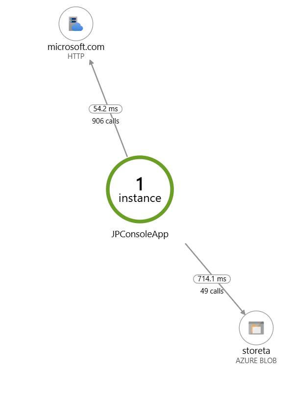

# Application Insights Console Monitor

A C# console application that monitors HTTP status and stores results in Azure Blob Storage, with full Application Insights telemetry integration.

This demo will cast following Application Map into Azure Portal:




## Features

- HTTP status monitoring of microsoft.com
- Azure Blob Storage integration for status logging
- Application Insights integration with:
  - Live Metrics streaming
  - Application Map support
  - Dependency tracking
  - Exception monitoring

## Prerequisites

- Azure subscription
- Application Insights resource
- Azure Storage account
- .NET 6.0 or later

## Configuration

The application requires two connection strings:

1. **Application Insights**
   - Connection string format:
     ```
     InstrumentationKey=<your-key>;IngestionEndpoint=https://<location>.in.applicationinsights.azure.com/
     ```

2. **Azure Storage**
   - Connection string format:
     ```
     DefaultEndpointsProtocol=https;AccountName=<storage-name>;AccountKey=<storage-key>;EndpointSuffix=core.windows.net
     ```

## Monitoring Features

- **Live Metrics**: View real-time performance in Azure Portal
- **Application Map**: Visualize dependencies:
  - HTTP calls to microsoft.com
  - Blob storage operations
- **Custom Events**: "HeartbeatEvent" tracked every second
- **Dependencies**: Tracked for both HTTP and Blob operations
- **Exceptions**: Automatic tracking of any runtime errors

## Output

- Console displays heartbeat status every 10 operations
- Blob storage receives status files with format: `status-YYYY-MM-DD-HH-mm-ss.txt`
- Application Insights receives:
  - Custom events
  - Dependency calls
  - Exceptions
  - Performance metrics

## Local Development

1. Clone the repository
2. Set up connection strings
3. Run the application:
   ```powershell
   dotnet run
   ```

## Viewing Results

1. **Azure Portal - Application Insights**
   - Live Metrics: Immediate performance view
   - Application Map: Dependency visualization
   - Logs: Detailed telemetry data

2. **Azure Storage Explorer**
   - Container: "httpstatus"
   - Files: Timestamped status reports

## License

This project is licensed under the MIT License - see the [LICENSE](LICENSE) file for details.